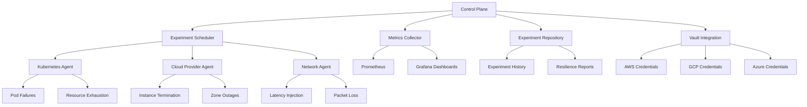

# Chaos Engineering Platform

## Overview
A comprehensive platform for implementing chaos engineering practices in cloud-native environments. This platform enables organizations to proactively identify system weaknesses by injecting controlled failures and observing system behavior under stress conditions.

## Key Features
- **Automated Failure Injection**: Programmatically introduce failures across infrastructure, network, and application layers
- **Real-time Monitoring**: Observe system behavior during chaos experiments with integrated dashboards
- **Experiment Scheduling**: Plan and execute experiments during designated maintenance windows
- **Resilience Metrics**: Quantify system resilience through standardized metrics
- **Multi-cloud Support**: Run experiments across AWS, GCP, Azure, and on-premises environments
- **Secure Secrets Management**: Integration with HashiCorp Vault for secure credential storage and access

## Architecture


## Technologies
- Kubernetes for orchestration
- Prometheus and Grafana for monitoring
- gRPC for agent communication
- Envoy for network chaos
- Terraform for infrastructure provisioning
- HashiCorp Vault for secrets management

## Failure Injection Capabilities

### Infrastructure Layer
- Instance termination
- Zone/region failover
- Resource exhaustion (CPU, memory)
- Disk failures

### Network Layer
- Latency injection
- Packet loss/corruption
- DNS failures
- Connection interruption

### Application Layer
- API errors
- Dependency failures
- Database query delays
- Cache invalidation

## Resilience Metrics
- **Mean Time to Recovery (MTTR)**: Average time to recover from a failure
- **Error Budget Consumption**: Rate at which the error budget is being used
- **Failure Injection Rate**: Number of chaos experiments run per week/month
- **Resilience Score**: Composite metric of system's ability to withstand failures

## Implementation Phases

### Phase 1: Foundation
- Control plane deployment
- Basic Kubernetes pod failure experiments
- Initial monitoring integration
- Vault integration for secrets management

### Phase 2: Advanced Capabilities
- Multi-cloud provider support
- Network chaos experiments
- Scheduled experiments
- Dynamic secrets with Vault

### Phase 3: Enterprise Features
- Compliance reporting
- Advanced analytics
- Automated remediation
- Secret rotation and audit logging

## Getting Started

```bash
# Clone the repository
git clone https://github.com/yourusername/chaos-engineering.git

# Deploy the control plane
cd chaos-engineering
./deploy.sh

# Set up Vault for secrets management
./setup-vault.sh

# Configure cloud provider access
./configure-cloud-access.sh --provider aws

# Run your first experiment
kubectl apply -f examples/pod-failure-experiment.yaml
```

## Example Experiments

### Pod Failure Experiment
```yaml
apiVersion: chaos.example.com/v1
kind: ChaosExperiment
metadata:
  name: pod-failure-test
spec:
  target:
    namespace: production
    selector:
      app: payment-service
  action:
    type: podFailure
    duration: 5m
    count: 1
  schedule:
    timeWindow:
      start: "2023-06-01T01:00:00Z"
      end: "2023-06-01T02:00:00Z"
  monitoring:
    prometheus:
      endpoint: http://prometheus.monitoring:9090
    alerts:
      - name: HighErrorRate
        threshold: 1%
```

### Network Latency Experiment
```yaml
apiVersion: chaos.example.com/v1
kind: ChaosExperiment
metadata:
  name: api-latency-test
spec:
  target:
    namespace: production
    selector:
      app: api-gateway
  action:
    type: networkLatency
    latency: 500ms
    duration: 10m
    percentage: 50
  schedule:
    cron: "0 1 * * 2"  # Every Tuesday at 1 AM
  monitoring:
    grafanaDashboard: http://grafana.monitoring/d/chaos-experiments
```

## Business Benefits
- **Improved Reliability**: Proactively identify and fix weaknesses before they affect customers
- **Reduced Downtime Costs**: Lower MTTR through practiced recovery procedures
- **Increased Confidence**: Safely deploy changes knowing systems can handle unexpected conditions
- **Cost Optimization**: Right-size infrastructure based on actual resilience requirements
- **Competitive Advantage**: Deliver more reliable services than competitors
- **Enhanced Security**: Secure management of sensitive credentials with Vault

## Case Studies

### Financial Services Company
Implemented chaos engineering to test their trading platform's resilience. Discovered and fixed critical weaknesses in their database failover mechanism, preventing a potential outage that would have cost an estimated $2M per hour.

### E-commerce Platform
Used network chaos experiments to identify performance degradation during simulated CDN failures. Implemented caching improvements that maintained 99.9% availability during an actual provider outage.

## Documentation

- [Getting Started Guide](docs/getting-started.md)
- [Experiment Types](docs/experiment-types.md)
- [Vault Integration](docs/vault-integration.md)
- [API Reference](docs/api-reference.md)

## Contributing
We welcome contributions! Please see [CONTRIBUTING.md](CONTRIBUTING.md) for details on how to submit pull requests, report issues, and suggest features.

## License
This project is licensed under the MIT License - see the [LICENSE](LICENSE) file for details.
